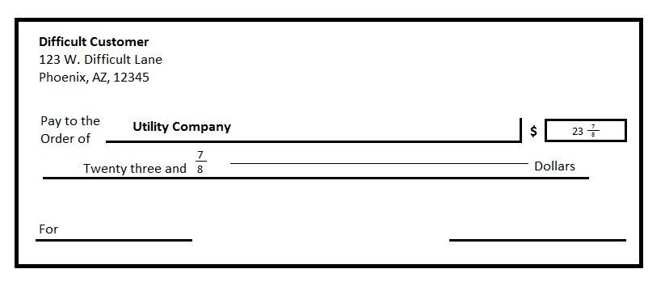
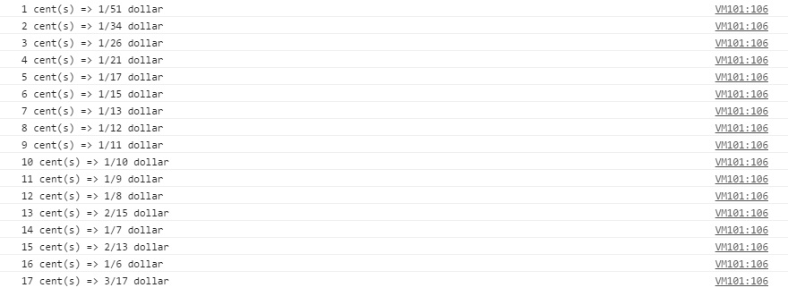

# Writing Checks the Hard Way
A simple programming challenge used to demonstrate my programming skills and problem-solving abilities using an Object Oriented approach with JavaScript (ECMAScript 6).

## Challenge Problem
In an effort to be as difficult of a customer as possible, you decide that from now on you will write all of your checks using a fraction for the cents portion of the amount. For example, to pay for a bill that is $23.87 you want to fill out your check like the one below.

Note that any fraction of a dollar that you write into a check will be rounded down to the nearest cent, meaning that multiple fractions exist that will round down to the same number of cents (e.g. both  and  round down to $0.01). Given that your goal is to be a difficult customer, you should always use the fraction with the smallest possible positive denominator. The check in Figure 1 could have been written as  but it is slightly more difficult to convert  into cents than it is to convert .

* To convert 1 cent ($0.01), any fraction between  and  might be used (or an infinite number of other fractions) since, when rounded down to the nearest hundredth, each converts to .01. However, the one with the smallest denominator is 
* To convert 3 cents ($0.03), any fraction between  and  might be used (or an infinite number of other fractions) since, when rounding down to the nearest hundredth, each converts to .03. However, the one with the smallest denominator is 
* The solution fractions for 7 cents, 8 cents, and 9 cents are , , and  respectively

## Code
Create a function (and supporting fraction class/object) that takes in some fraction of a dollar in units of cents (1¢  to 99¢) and returns a Fraction object in units of dollars.

## Screenshot
 

## Built with
* JavaScript ES6
* ESLint
* Notepad++

## Author
* **Jarid Bredemeier**

## License
Apache license 2.0
